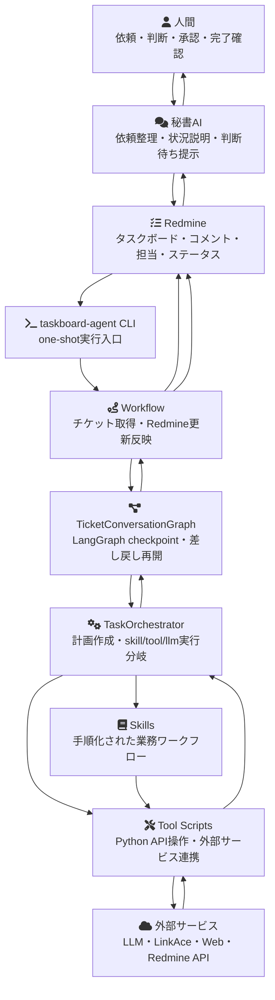

# taskboard-agent-orchestrator

秘書AIとタスクボードを仲介にして、AIエージェントが業務タスクを継続的に処理するための実行基盤です。

初期実装では Redmine をタスクボードとして扱い、AIユーザーに割り当てられたチケットを1件取得して、依頼内容の理解、計画、スキルまたはtoolの実行、進捗コメント、レビュー戻しまでを one-shot CLI で処理します。

## 目的

このプロジェクトの目的は、人間が秘書AIへ自然文で依頼し、秘書AIがタスクボードを整理し、AIエージェントがタスクボード上の作業を安全に実行できる仕組みを作ることです。

人間はタスクの細かい状態管理を直接行い続けるのではなく、秘書AIとの対話で依頼、判断、承認、完了確認を行います。AIエージェントはタスクボードを作業台帳として使い、進捗、成果物、判断待ち、作業履歴を残します。

## システム全体像



## 登場人物

- 人間: 作業を依頼し、判断、承認、差し戻し、完了確認を行う。
- 秘書AI: 人間の依頼をタスクとして整理し、状況や判断待ち事項を人間に説明する想定の窓口。
- Redmine: 初期タスクボード。依頼内容、担当、ステータス、コメント、成果報告を保持する。
- `taskboard-agent CLI`: Redmine上の処理対象チケットを1件処理する実行入口。
- `Workflow`: Redmineチケット取得と、実行イベントをRedmineコメント・ステータス・担当者更新へ反映する層。
- `TicketConversationGraph`: LangGraphでチケット単位の会話、計画、成果、差し戻し再開状態を保存する層。
- `TaskOrchestrator`: チケット内容から実行計画を作り、skill、tool、LLMだけでの処理、ユーザー確認待ちへ分岐する層。
- `Skills`: 複数toolや判断手順をまとめた業務単位の手順書とrunner。
- `Tool Scripts`: Web取得、Redmine API、LinkAce API、LLM要約などを行うPython tool。
- 外部サービス: LiteLLM経由のLLM、Redmine REST API、LinkAce、Webページ取得など。

## リポジトリ構成

- `src/taskboard_agent/`: CLI、Redmine連携、LangGraph会話、タスク計画、tool/skill実行の実装
- `tool_scripts/`: LLMまたはスキルrunnerから呼び出せるPython tool
- `skills/`: 手順化された業務スキル
- `docs/`: アーキテクチャ、設計、ロードマップ、ユースケース、ADR
- `tests/`: pytestによるユニットテスト

Redmine操作はMCPではなく、Python実装からRedmine REST APIを呼び出します。PDF抽出は現時点の要件ではなく、必要になった時点で別途設計します。

## セットアップ

```powershell
uv sync
Copy-Item .env.example .env
```

`.env` に以下を設定します。実環境変数が同名で定義されている場合は、実環境変数が優先されます。

```dotenv
REDMINE_URL=https://redmine.example.com
REDMINE_API_KEY=replace-with-redmine-api-key
REDMINE_AI_USER_ID=123
REDMINE_IN_PROGRESS_STATUS_ID=2
REDMINE_REVIEW_STATUS_ID=10
LLM_MODEL=replace-with-litellm-model
LINKACE_URL=https://linkace.example.com
LINKACE_API_KEY=replace-with-linkace-api-key
LINKACE_SUMMARIZED_LIST_ID=10
LANGGRAPH_CHECKPOINT_DB_PATH=.taskboard-agent/checkpoints.sqlite3
```

`LANGGRAPH_CHECKPOINT_DB_PATH` はチケット単位のLangGraph会話コンテキストを保存するSQLiteファイルです。`--dry-run` ではインメモリCheckpointerを使用するため、このファイルは更新されません。

言語モデルの呼び出しはLiteLLM経由で行います。`LLM_MODEL` には `openai/gpt-4.1-mini`、`anthropic/claude-...`、`gemini/...`、`ollama/...`、`lm_studio/...` などLiteLLMが扱うモデル名を指定し、APIキーやAPI Base URLは各プロバイダが要求する環境変数に設定してください。

計画、再計画、実行状態など機械処理する応答にはLiteLLMの `response_format` からStrict JSON Schemaを指定します。利用するプロバイダ、推論サーバー、モデルはStructured Outputsに対応している必要があります。

## 実行

AIユーザーに割り当てられたRedmineチケットを1件処理します。

```powershell
uv run taskboard-agent run-once
```

特定のチケットを直接処理します。

```powershell
uv run taskboard-agent run-once --issue-id 123
```

Redmineや外部サービスを更新せず、依頼理解、スキル選択、tool実行結果だけ確認します。

```powershell
uv run taskboard-agent run-once --dry-run
```

## ドキュメント

- [docs/use-cases.md](docs/use-cases.md): 実装対象ユースケースと成長順
- [docs/architecture-current.md](docs/architecture-current.md): 現在の実装構造
- [docs/architecture-target.md](docs/architecture-target.md): 目指すアーキテクチャ
- [docs/tools-and-skills.md](docs/tools-and-skills.md): 現在利用できるtoolとskill
- [docs/roadmap.md](docs/roadmap.md): 段階的な改善計画
- [docs/adr/README.md](docs/adr/README.md): アーキテクチャ判断記録
- [AGENTS.md](AGENTS.md): エージェント向け開発方針

READMEは初回読者が目的、背景、使い方を把握するための入口に限定します。詳細な設計情報や実装方針は `docs/` 以下に記載します。
