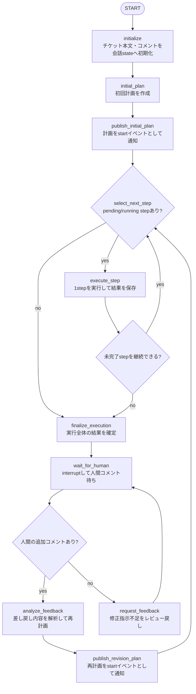

# TicketConversationGraph のLangGraph構造

この文書は、現在の `TicketConversationGraph` が構築するLangGraphのノード、エッジ、state、再開動作を説明する。実装の正は `src/taskboard_agent/ticket_graph.py` であり、この文書は実装を読むための地図として扱う。

## 目的

`TicketConversationGraph` は、Redmineチケット1件をLangGraph threadかつ会話sessionとして扱い、model-visible context、実行計画、step単位の実行状態、artifact参照、差し戻し後の再計画をcheckpointへ保存する。

Redmine API更新はこのグラフから直接行わない。グラフは `SkillEvent` をemitし、`workflow.py` がRedmineコメント、ステータス、担当者変更へ変換する。

## グラフ全体

実装上、`select_next_step` と `execute_step` の分岐はLangGraphのconditional edgeで表現している。`MoreSteps` と `Feedback` は説明用の分岐ラベルであり、独立したノードではない。

## ノード責務

| ノード | 責務 | 主なstate更新 |
| --- | --- | --- |
| `initialize` | issue本文とjournalを`ConversationTurn`へ変換し、session stateを作る。legacyの長いassistant turnはartifact化する。 | `working_memory`, `session_checkpoint`, `recent_turns`, `active_artifacts`, `artifact_refs` |
| `initial_plan` | context engineでplanning入力を組み立てて初回計画を作る。 | `current_plan`, `plan_steps`, `working_memory`, `session_checkpoint`, `recent_turns` |
| `publish_initial_plan` | 初回計画をRedmine向け `start` イベントとしてemitする。conversation turnにはしない。 | なし |
| `select_next_step` | `pending` または `running` のstepを1件選び、`running` にする。 | `plan_steps`, `current_step_index`, `run_status` |
| `execute_step` | 選択artifact本文だけを含むcontextで1step実行し、成果物本文をartifact store、参照をstateへ保存する。 | `working_memory`, `plan_steps`, `step_results`, `active_artifacts`, `artifact_refs` |
| `finalize_execution` | 全体statusを決め、正規assistant回答だけをturnとartifactへ保存する。Redmineイベント仕様は維持する。 | `last_result`, `working_memory`, `recent_turns`, `active_artifacts`, `artifact_refs` |
| `wait_for_human` | interrupt後、新しい人間journalをID順に1 user turnへまとめる。AI progress journalはturnへ再取り込みしない。 | `issue`, `recent_turns`, `last_ingested_journal_id`, `working_memory` |
| `analyze_feedback` | session contextから差し戻しを解析して再計画する。必要なら古いturnをcompactionする。 | `feedback_analysis`, `current_plan`, `working_memory`, `session_checkpoint`, `recent_turns` |
| `publish_revision_plan` | 再計画を `start` イベントとしてemitする。conversation turnにはしない。 | なし |
| `request_feedback` | 追加指示不足をレビュー戻しし、正規回答だけをturn/artifact化する。 | `last_result`, `working_memory`, `recent_turns`, `artifact_refs` |

## 主要state

| state | 内容 |
| --- | --- |
| `issue_id` | Redmine issue ID。thread IDは `redmine-issue-{issue_id}` を使う。dry-runでは `-dry-run` suffixを付ける。 |
| `issue` | journalを除いたissue情報。resume時は最新issueで更新する。 |
| `messages` | legacy checkpoint遅延変換用。新規stateでは空で、モデル入力には使わない。 |
| `working_memory` | issue、現在計画、step状態、run status、待機理由、active artifactを決定的に表した実行メモリ。 |
| `session_checkpoint` | 圧縮済み会話の要約、決定、制約、未解決事項、現在位置、選択artifact、圧縮済みturn ID。 |
| `recent_turns` | 未圧縮のuser/assistant正規turn。計画・progress・tool内部ログは含めない。 |
| `active_artifacts` | 論理名からversionとartifact IDへの対応。過去版は削除しない。 |
| `artifact_refs` | content-addressed artifactのID、種類、byte数、hash、source、表示名、field一覧。本文は含めない。 |
| `last_ingested_journal_id` | 取り込み済みRedmine journalの最大ID。resume時に重複取り込みを避ける。 |
| `current_plan` | 現在実行中の `TaskPlan` をdict化したもの。 |
| `plan_steps` | 実行計画のstep配列。stepは削除せず `status` を更新する。 |
| `current_step_index` | 現在実行中または停止中のstep index。成功完了時は `None` に戻す。 |
| `step_results` | 実行済みstepごとの結果履歴。step ID、status、実行結果、イベント、artifactを保存する。 |
| `run_status` | グラフ全体の現在status。例: `initialized`, `planned`, `running`, `processed`, `failed`, `needs_user`, `missing_tool`, `dry_run`。 |
| `step_context` | 計画理由、制約、最後のstatusなどの小さな互換メタデータ。会話本文は保持しない。 |
| `artifacts` | `artifact_refs`と同じ参照形式を保持する互換field。成果物本文は保持しない。 |
| `feedback_analysis` | 差し戻しコメントを解析した構造化結果。 |
| `waiting_reason` | `wait_for_human` で停止する理由。 |
| `last_result` | `TicketConversationGraph.run()` が返す最終 `SkillExecutionResult` 相当のdict。 |

## Step状態

`plan_steps` の各stepは配列から削除せず、以下のstatusで管理する。

| status | 意味 |
| --- | --- |
| `pending` | 未実行。 |
| `running` | `select_next_step` で選択済み。 |
| `completed` | `processed`, `already_done`, `dry_run` として完了。 |
| `skipped` | 実行対象外としてスキップ。 |
| `needs_user` | 人間判断待ち。`missing_tool` もstep状態としてはここに寄せる。 |
| `failed` | step実行に失敗。 |

最終statusは `finalize_execution` で `plan_steps` を走査して決める。`failed` があれば全体は `failed`、`needs_user` があれば `needs_user` または `missing_tool`、それ以外は `processed` または `dry_run` になる。

## Redmine向けイベント

グラフはRedmineを直接更新せず、以下の `SkillEvent` をemitする。

| タイミング | kind | 内容 |
| --- | --- | --- |
| 初回計画公開 | `start` | 計画内容と作業開始。`workflow.py` で進行中ステータスへ更新される。 |
| step開始 | `progress` | `ステップ N を開始しました: ...` |
| step実行中の詳細 | `progress` | `TaskOrchestrator.execute_single_step()` から返る進捗や結果。 |
| step結果 | `progress` | 完了、スキップ、判断待ち、失敗を記録する。 |
| 全体成功 | `progress` + `final_review` | step全体の終了メッセージをprogressにし、最後にレビュー戻しする。 |
| 全体失敗・判断待ち | `final_return` または `final_review` | 既存の担当者戻し、レビュー中ステータス更新仕様を維持する。 |
| 差し戻し後の再計画 | `start` | 差し戻し内容、維持する成果、今回対応する内容、再計画。 |

## 再開動作

`run()` はcheckpointの状態を見て、次の3経路に分岐する。

1. checkpointがなく初回実行の場合  
   `initialize` から開始する。

2. `wait_for_human` でinterrupt中の場合  
   最新issueから未取り込みjournalだけをresume payloadとして渡す。設定済みエージェントが過去に投稿した同一内容は重複取り込みしない。人間コメントがあれば `analyze_feedback` へ進む。

3. checkpointに `next` が残っている場合  
   前回プロセスが途中で止まった状態として、次ノードから継続する。差し戻し後のstep実行途中なら、再開コメントを `start` としてemitしてから続ける。

## 責務境界

- `TicketConversationGraph` は状態遷移、checkpoint、step選択、resume判定を担当する。
- `TaskOrchestrator` は計画作成と1step実行の実作業を担当する。
- `workflow.py` は `SkillEvent` をRedmine更新へ変換する。
- Redmine更新責務をLangGraphノードへ直接移さない。
